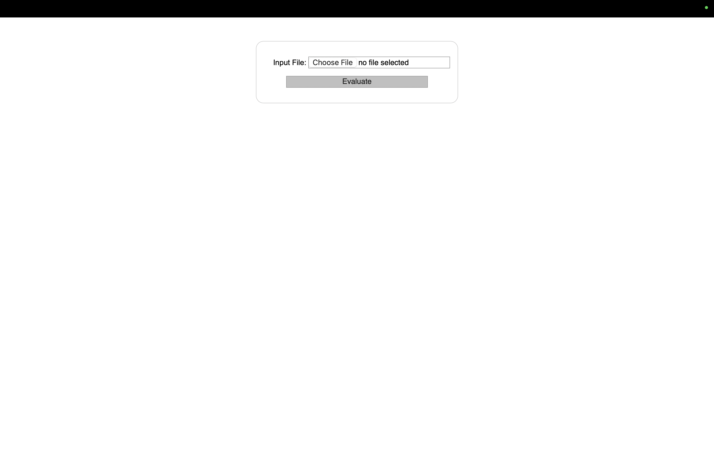

# Take Home Assignment for Watermark detection

The project finds the watermark of the specified company in the dataset. Model uses yolov11 for inference. The approach for the project is as follows. The repository has following directory structure

| Folder/File Name Name | Description | 
| ----------- | ------------|
| Automation  | Contains Files for CI/CD deployment. Current it includes files automated docker build and push using Github Labs |
| DataProcessing  | Files for initial data processing |
| DataProcessing/datasets  | Folder `train/images`; `train/labels` contains the training data generated from `data_preprocessing.py` and `validation/images` and `validation/labels` contains the the validation data generated   |
| DataProcessing/data_preprocessing.py  | Function that allows labelling generating dataset and prepare the same for training  |
| data_train | To train and validate the data on yolov11. The model is deployed on a ONNX runtime framework |
| data_inference | Host the API server code, Dockerfile, and runtime inference code. The runtime is served using `onnxruntime` and FastAPI server |
| orchestration | Contains Kubernetes deployment and service files |


Steps followed for the model processing and inference

## 1. Data Processing

Based on the dataset provided a train and validation dataset is prepared. Following approach is carried out.
1. Resizing the image: The image is resized to 640x640 as the model takes this dimension as an input parameter
2. Augmentation: Following approach for augmentation is carried out
    - Horizontal filliping: Changes the orientation of the image by 180 degrees
    - Verical flipping: Changes thhe orientation of the image by 90 degrees
    - Scaling: Positive Affine Scaling
    - Negative Affine Scaling
    - Gaussian Blurring
    - Addition of the gaussian noise
    - Multiply noise  =with different core matrix
The approach for the image augmentation is to add different lighting conditions and image orientation.
3. Splitting the Image: The Image is further split into train/validation with the ratio of 80(train)-20(validation)
4. Dataset orientation: The data is further oriented in coco format for the ease of use as illustrated below.
5. Labes are stored as <class-name> <x> <y> <height> <width>. All parameters are normalized

```yaml
path: ../datasets
train: train/images
val: val/images
names:
  0: watermark
```

## 2. Model Training

The model training process involves training using yolov11. Following hyper parameters were considered (customized from the default training model)
- epochs : 100 
- intial learning rate: 0.1
- weight decay: 0.1 for 3 consecutive epochs

The model is evaluated against following parameters after training for 100 epochs. 

| Metric | Description | Train Value | Validation Value |
| ------ | ----------- | ------------| -----------------|
| F1 Score | Measure of predictive performance based on model's ability to correctly classify images containing watermark or not | 0.98 | 0.98 | 
| Box Loss | Measure of accuracy of the model to accurately detect object (watermark) in the given image | 0.43 | 0.27 | 
| Classifier Loss | Model's ability to correctly classify the classes. Since the model predicts the existance of watermark, the model is a binary classifier in this scenario | 0.99 | 0.98 |
| mAP50 | mean average precision over intersection unit IoU. It calculates the average precision over all classes. This calculates the overlap of 50% | 0.98 | 0.98 |
| mAP95 | mean average precision over intersection unit IoU. It calculates the average precision over all classes. This calculates the overlap of 95% | 0.74 | 0.74 |

- Model export: After training the model is exported to onnx format. This allows serving the model agnostic to the serving environment

The model did object detection on a single class for watermark. For better accuracy, a pretrained model (model trained on COCO dataset) was used. Compared to training the model on Yolov8 model had a slight advantage with respect to precision and accuracy

# Data Inference 

The directory provides a mechanism for providing the runtime inference for the model. `inference/model.onnx` forms the backbone of the inference. `onnxruntime` is used as the runtime serving model. The serving model takes numpy image as an input. Following are the set of steps followed after initial model loading. For a given image inference process is as follows

1. Preprocessing: The image is scaled to 640x640 normalized and made compatible with onnx model to be trained. `inference/inference_helper.py <preprocess>`
2. Model Inference: Onnx runtime is used to give initial prediction from the model. 
3. NMS prediction: At inference gives class prediction, bounding box and confidence percentage. The confidence of 25% is used for the inference. 
4. Adding Bounding boxes: If watermark is predicted bounding boxes are added to the image. 


### FastAPI for model serving

The model is served on FastAPI. Following are the specification

| Method Type | End point | Parameters | Return | Description |
| ----------- | ----------| ---------- | ------ | ---- |
| GET         |  `\`      | None       | None   | Allows the rendering the html template | 
| POST        | `\`       | `file_path`, `file` | Image: If the watermark exists then a image with watermark highlighted is returned else original image is returned; `label`: Class Label | Makes the runtime inference and returns the labeled data | 


## Running the Inference Locally

The model is served using onnxruntime and fastapi server and assumes the user has python installed

Steps for Usage

1. Install the required requirements
```bash
pip install -r requirements.txt
```

2. Run the FastAPI server
```bash
fastapi run app.py --port <port_number>
```

3. Open the port on the server `localhost:<port_number>`, upload the image and click evaluate



4. Validate the results


## Running Inference using docker 

Build the image 

```bash
docker build . inference_model:latest
```


Run the docker image 

```bash
docker run -it -p 3000:3000 inference_model:latest
```

For inference perform the steps as before.

## Orchestration

The model can be deployed on an orchestration environment like kubernetes. 

1. Build deploy the docker image to the respective repository
2. Deploy the model on the (pod_name) name and service in the respective service
3. Deploy an ingress service to the pod to allow inference online. 

## Automation

Githib actions and ArgoCD can be used to deploy the model on a running environment. MLOPs operations can be used for tooling and metric monitoring. 

## Challenges

The model is trained and finetuned on a limited datasets with limited labels on. It can be further generalized with additional datasets/watermark formats